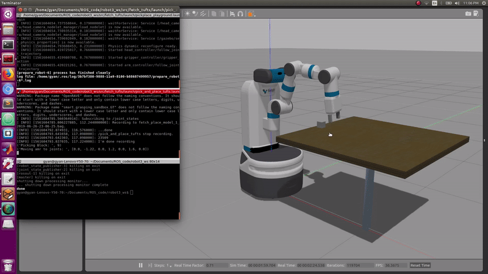

# Fetch - Grasp, Pick, Hold, Shake and Place

This package launches gazebo world, Fetch robot, table and block on the table. The Fetch robot performs Grasp, Pick, Hold, Shake and Place behaviors on the block and record each behavior in a separate rosbag file.



## Requirements

1. Ubuntu 16.04
2. ROS Kinetic
3. Gazebo 7.x

## ROS Packages

```
sudo apt-get install ros-kinetic-costmap-2d
sudo apt-get install ros-kinetic-opencv-candidate
sudo apt-get install ros-kinetic-rgbd-launch
sudo apt-get install ros-kinetic-robot-controllers
```

## How to run?
`roslaunch fetch_tufts pickplace_playground.launch` <br>
`roslaunch fetch_tufts pick_and_place_tufts.launch num_of_run:="# of trials"` <br>

Example: <br>
`roslaunch fetch_tufts pick_and_place_tufts.launch num_of_run:=2`
